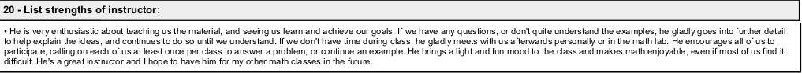

# Grant Moore

---

<div align="center">
    
</div>

---

```python
"""
The Invocation of Metric Code 
=============================

A Pythonic poem in (mostly) metric form. 

.. tip::

    it matters not the form of thought,
    in verse or code, a mix of both,
    these words command with meaning fraught
    the rush of green through stalks of growth
    in ground of earth or problem sought,
    with meter found in solemn oath. 

Hacks until the devs publish a fix:

- "()", "[]", ".", ":", "_",  "=" and "==" don't contribute!
- Comments are part of the poem! Except this one!
- "pprint" = "puh-PRINT"

"""
# at first, this helpful little shape
from re import escape
# and then some help for those who squint
import pprint # that alters tint
# at last, these ready words are spoke
import invoke # to pry and poke
import my_heart # but tender hold
import provoke as smoke
import thy_art # to break the mold

def use(this="thought", with_mode="exhaust"):
    """
    Where dreams become though some are lost...
    """
    try: # hope, but keep your fingers crossed...

        if not (with_mode in [ "act", "retain"]): 
            return "what's left of last remain"

        if type(f'of {this}') == thy_art.a_ring:
            return my_heart.to_spring(
                myself_is = this, but = ("suffering")
            )

        # TODO: Alas! Another miss!
        raise smoke.abyss(with_only = this)

    except RecursionError as remiss:
        pprint.pprint("renew, and don't dismiss!")
        this = set(escape(remiss))
        return invoke.Oh.muse(" " and "please").sing(this)

# HOTFIX: Let this "==" be "is"! But only here!
# Oh, don't complain, just play the game! 
if __name__ == "__main__":
    invoke.with_fuse()
    invoke.Oh.muse([   
        " " and use(this=dream, with_mode="retain")
        for dream in smoke.of_wing
        if dream is all(thy_art.to_bring())
    ])

```

## Education

|  School  |  Degree  | Field of Study | Graduation |
|--------- | -------  | -------------- | ---------- |
| Towson University | Master's Degree | Mathematics | 2013 |
| Frostburg State University | Bachelor's Degree | Physics | 2010 |

## Experience

### Employment History 

| Employer  | Role  | Dates |
| --------  | ----  | ----- |
| ProvisionIAM | Senior Site Reliability Engineer | March 2025 - Present |
| MDThink    | DevOps Director       | June 2024 - December 2024 |
| Bishop Walsh | Math Teacher | September 2023 - June 2024 |
| IHS Markit | Software Engineer | October 2022 - March 2023 |
| Booz Allen Hamilton | Staff Engineer | June 2022 - December 2023 |
| Makpar | DevOps Engineer | October 2021 - May 2022 |
| IBM | Full Stack Developer | June 2019 - April 2021 |
| Front Range Community College | Mathematics Professor | January 2018 - December 2018 |
| University of Cincinnati | Adjunct Professor | August 2017 - December 2017 |
| YTI Career Institute | Math Instructor | August 2015 - December 2015 |
| Frostburg State University | Adjunct Professor | August 2015 - May 2017 | 
| Allegany College of Maryland | Adjunct Professor | January 2015 - December 2015 |
| Hamilton Relay | Relay Operator | April 2014 - December 2014 |
| IBM | Conversion Worker | November 2013 - April 2014 | 
| Walmart | Cashier | November 2011 - September 2012 |
| Active Network | Reservation Specialist | January 2011 - August 2011 |
| Savage River Lodge | Maintenance | June 2010 - November 2010 |
| Burger King | Slave | March 2009 - August 2009 | 
| Fox's Pizza | Delivery Driver |  February 2009 - January 2010 |
| Ruby Tuesday | Cook |  April 2008 - January 2009 |
| Denny's | Cook | June 2007 - February 2008 | 
| Banana Cafe | Dishwasher | May 2006 - September 2006 | 

### Volunteer History

| Organization | Role | Dates | 
| ------------ | ---- | ----- | 
| Americorps | Mathematics Tutor | August 2014 - August 2016 |

### Certifications

| Organization  | Certifications |
|-------------- | -------------- |
| AWS | <a href="./assets/aws-certified-developer-associate.png">  </a></div> <a href="./assets/aws-certified-devops-engineer-professional.png"> </a> |
| IBM | <a href="./assets/aws-certified-developer-associate.png"></a> <a href="./assets/ibm-docker-introduction.png">  </a> |
| MTA | <a href="./assets/mta-database-fundamentals-certified-2018.png"></a> <a href="./assets/mta-introduction-to-programming-using-java-certified-2018.png>"></a> <a href="./assets/mta-introduction-to-programming-using-python-certified-2018.png"></a> <a href="./assets/mta-software-development-fundamentals-certified-2018.png"></a> |
| SOA | [Exam FM](./assets/soa-exam-fm.png) [Exam P](./assets/soa-exam-p.png) |

### Testimonials




## The Unicode Ode

🧍‍♀️ ∥ 🍀 ∥ 🎲 ∥ 🔮 ∥ 🎲 ∥ 🍀 ∥🧍‍♂️  
🎻-👗-👠 ≈ 😬 ≈ 👞-👔-🎻  
🌙 ⊥ [∞] {🌹, 🥂, 🍝,🕯️} [∞] ⊥ ✨  
[[💃 ∪ 🕺] ∩  🎼 ] ∝ ⏳ 𝆒 #  


[🫀 ∧ 🧠 ∧ 🫁] ↔ [💬 ∧ 💭 ∧ 💘]  
[🫀 ≠ 💘] ∧ [🧠 ≠ 💭] ∧ [🫁 ≠ 💬]  
∀ 👁️ ∈ 😍 : Σ 👁️ =  🎯(🔥)  
∃ 💋 ∈ 😘 : 🌍 ⊂ 💋
 

⏳ ⊥ [𝄞] {🌹, 🕰️, 🌹} [𝄞] ⊥ ⌛  
🌕-🎶-🌖-🎵-🌗-𝅝𝅥-🌘-∅-🌑


🏃-💭-🌳 ... 🏃-💭-🏡 ... 🏃-💭-🏥  
🍀(😨 + 🚑 → 😱 + 🩺 → 💀 + 🪦)  
🥀 → 🌧️ + 🌱 = 😭 + 💭(💃 ∪ 🕺) + 🕸️  
🚶-💭-🍃 ... 🚶-💭-🔔 ... 🚶-💭-⛪


💭([💃 ∪ 🕺] - 💃  ≠  🕺)  
💭([💃 ∪ 🕺] - 💃 ⊂ 💃)  
💤(💃(🔥) → 💘(🎼))  
🪞(🌀(🌀(🌀(🌀(🌀))))) → 🕊️(🕰️)


🧔 + 🎹 = 🎶(💃) ∝ ⏳ 𝆒 # 