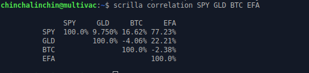
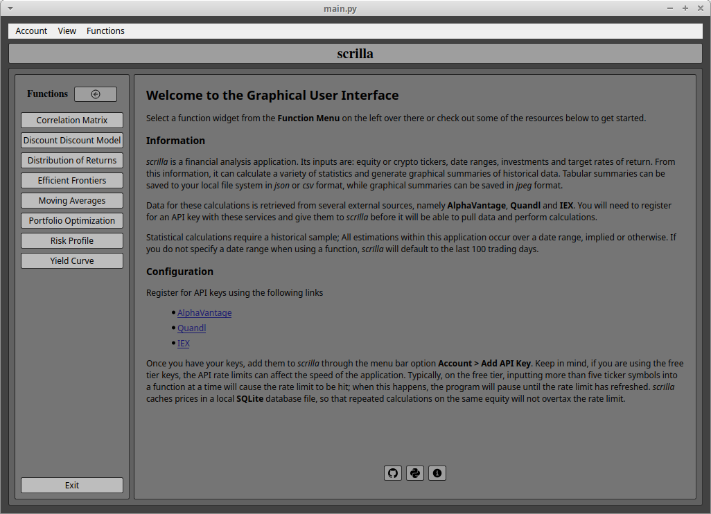

# Grant Moore

---

    

---

*ό ποιητα, ἡ πιθι ἡ ’απιθι*

## Summary

[Get some.](https://www.chess.com/member/thegrapesofmath)

## Education

|  School  |  Degree  | Field of Study | Graduation |
|--------- | -------  | -------------- | ---------- |
| Towson University | Master's Degree | Mathematics | 2013 |
| Frostburg State University | Bachelor's Degree | Physics | 2010 |

## Experience

### Employment History 

| Employer  | Role  | Dates |
| --------  | ----  | ----- |
| MDThink    | DevOps Director       | June 2024 - Current |
| Bishop Walsh | Math Teacher | September 2023 - June 2024 |
| IHS Markit | Software Engineer | October 2022 - March 2023 |
| Booz Allen Hamilton | Staff Engineer | June 2022 - December 2023 |
| Makpar | DevOps Engineer | October 2021 - May 2022 |
| IBM | Full Stack Developer | June 2019 - April 2021 |
| Front Range Community College | Mathematics Professor | January 2018 - December 2018 |
| University of Cincinnati | Adjunct Professor | August 2017 - December 2017 |
| YTI Career Institute | Math Instructor | August 2015 - December 2015 |
| Frostburg State University | Adjunct Professor | August 2015 - May 2017 | 
| Allegany College of Maryland | Adjunct Professor | January 2015 - December 2015 |
| Hamilton Relay | Relay Operator | April 2014 - December 2014 |
| IBM | Conversion Worker | November 2013 - April 2014 | 
| Walmart | Cashier | November 2011 - September 2012 |
| Active Network | Reservation Specialist | January 2011 - August 2011 |
| Savage River Lodge | Maintenance | June 2010 - November 2010 |
| Burger King | Slave | March 2009 - August 2009 | 
| Fox's Pizza | Delivery Driver |  February 2009 - January 2010 |
| Ruby Tuesday | Cook |  April 2008 - January 2009 |
| Denny's | Cook | June 2007 - February 2008 | 
| Banana Cafe | Dishwasher | May 2006 - September 2006 | 

### Volunteer History

| Organization | Role | Dates | 
| ------------ | ---- | ----- | 
| Americorps | Mathematics Tutor | August 2014 - August 2016 |

### Certifications

- [AWS DevOps Professional](./assets/AWS_DEVOPS.png)
- [AWS Developer Associate](./assets/AWS_DEVELOPER.png)
- [MTA Database Administration](./assets/MTA_DATABASE.png)
- [MTA Python Programming](./assets/MTA_PYTHON.png)
- [MTA Java Programming](/assets/MTA_JAVA.png)
- [MTA Software Development](./assets/MTA_SOFTWARE.png)
- [SOA Exam: Financial Mathematics](./assets/SOA_EXAM_FM.png)
- [SOA Exam: Probability](./assets/SOA_EXAM_P.png)

### Testimonials

## Current Projects

### Scrilla
- [PyPi](https://pypi.org/project/scrilla/)
- [GitHub](https://github.com/chinchalinchin/scrilla)
- [Documentation](https://chinchalinchin.github.io/scrilla/)

    

*scrilla* is a financial analysis application written in Python. It started as a command line utility for retrieving financial data and optimizing portfolio allocations over historical samples, but has since expanded to cover a wide range of analytical tools. I have developed a GUI wrapper around its main functions for easier user access. Give it a go! See the documentation for more information on installation.

### Ontology

*ontology* is a 2D game engine that implements [Liberated Pixel Cup](https://lpc.opengameart.org/) specification. It is written to ingest configuration YAML markup and generate worlds based solely on the parsed values. 

I started this back in 2012-ish, right after the Liberated Pixel Cup actually occurred. Initially it was just a fun way to learn to programming and engineering paradigms, but it has since evolved into a way for me to experiment with various ideas. I go back to this project every few years and try to improve it. I have a vision of what it is supposed to be, but there are lots of things to do before I can call it complete.

I would like to design a dynamic game engine without any determinate scripting. I want this to be a way of creating a virtual world through some basic configuration and then allowing it to evolve according to its own logic. I have been trying to craft an NPC reaction system that affects in-game events, but the logic is becoming very complicated. Next time I return to this project, I will probably try to revamp the NPC logic a bit.

### Bishop Walsh Math

I taught AP Statistics at Bishop Walsh High School during the 2023 - 2024 school year (I also subbed for the AP Calculus course while the regular teacher was out on leave). In doing so, I cobbled together a website using Python and Sphinx for the students to use. You can find my efforts at [bw-math](https://bishopwalshmath.org). You may freely use anything you find on the website. It's got a ton of great resources for learning probability and statistics!
