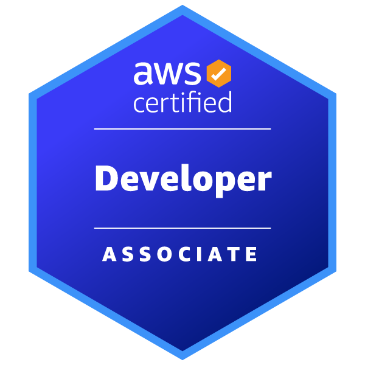
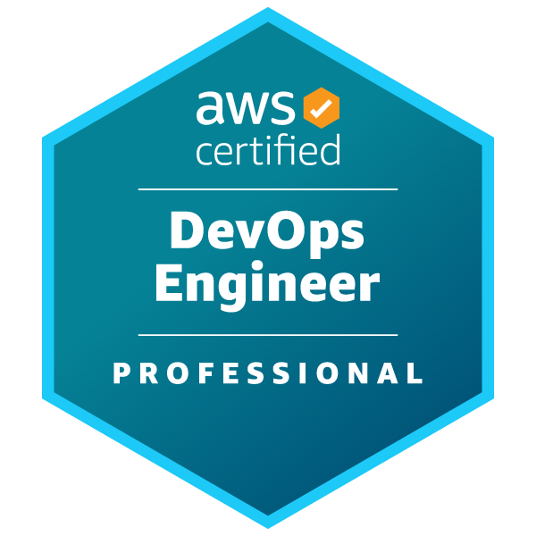
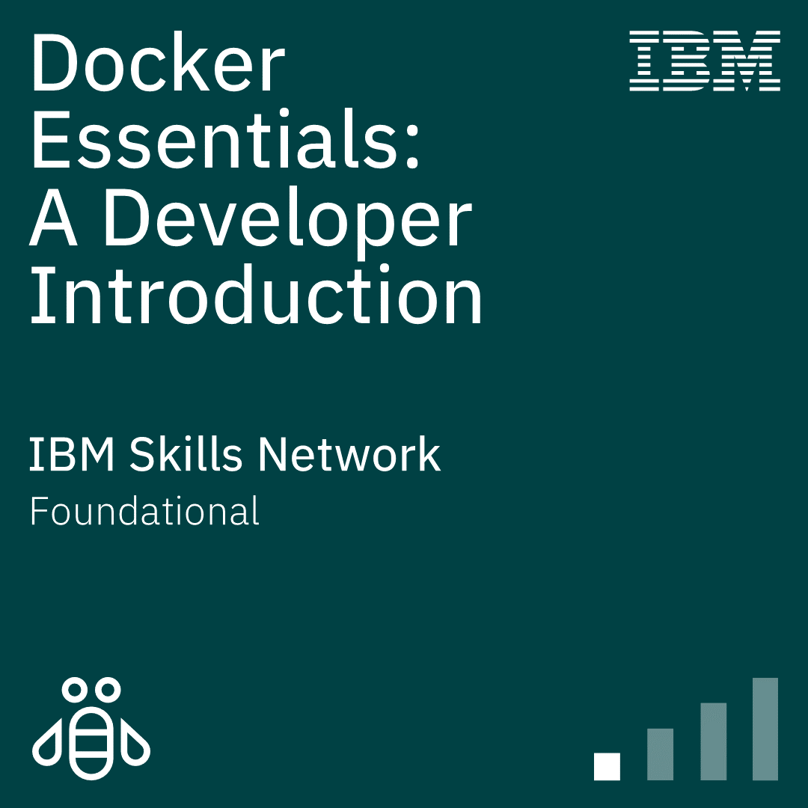
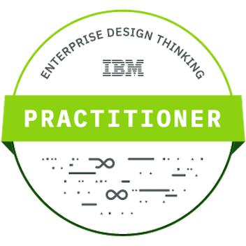
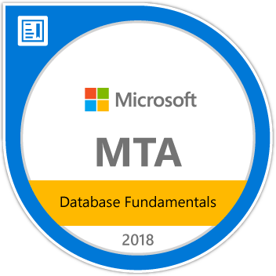
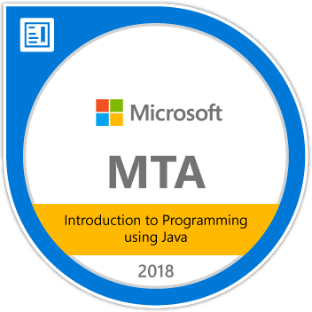
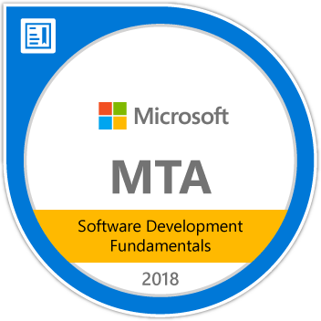
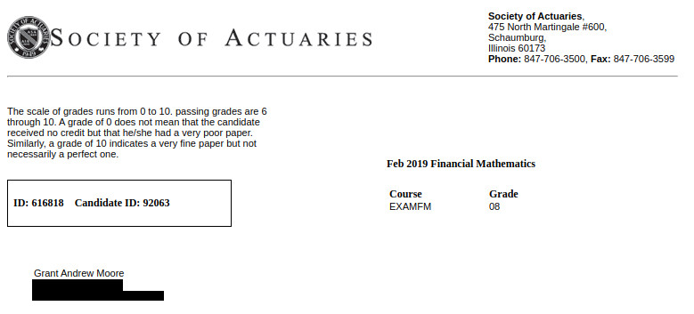
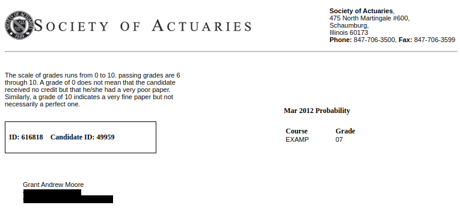

# Grant Moore

---

    

---

## Education

|  School  |  Degree  | Field of Study | Graduation |
|--------- | -------  | -------------- | ---------- |
| Towson University | Master's Degree | Mathematics | 2013 |
| Frostburg State University | Bachelor's Degree | Physics | 2010 |

## Experience

### Employment History 

| Employer  | Role  | Dates |
| --------  | ----  | ----- |
| MDThink    | DevOps Director       | June 2024 - December 2024 |
| Bishop Walsh | Math Teacher | September 2023 - June 2024 |
| IHS Markit | Software Engineer | October 2022 - March 2023 |
| Booz Allen Hamilton | Staff Engineer | June 2022 - December 2023 |
| Makpar | DevOps Engineer | October 2021 - May 2022 |
| IBM | Full Stack Developer | June 2019 - April 2021 |
| Front Range Community College | Mathematics Professor | January 2018 - December 2018 |
| University of Cincinnati | Adjunct Professor | August 2017 - December 2017 |
| YTI Career Institute | Math Instructor | August 2015 - December 2015 |
| Frostburg State University | Adjunct Professor | August 2015 - May 2017 | 
| Allegany College of Maryland | Adjunct Professor | January 2015 - December 2015 |
| Hamilton Relay | Relay Operator | April 2014 - December 2014 |
| IBM | Conversion Worker | November 2013 - April 2014 | 
| Walmart | Cashier | November 2011 - September 2012 |
| Active Network | Reservation Specialist | January 2011 - August 2011 |
| Savage River Lodge | Maintenance | June 2010 - November 2010 |
| Burger King | Slave | March 2009 - August 2009 | 
| Fox's Pizza | Delivery Driver |  February 2009 - January 2010 |
| Ruby Tuesday | Cook |  April 2008 - January 2009 |
| Denny's | Cook | June 2007 - February 2008 | 
| Banana Cafe | Dishwasher | May 2006 - September 2006 | 

### Volunteer History

| Organization | Role | Dates | 
| ------------ | ---- | ----- | 
| Americorps | Mathematics Tutor | August 2014 - August 2016 |

### Certifications

    

    

    

    

### Testimonials

