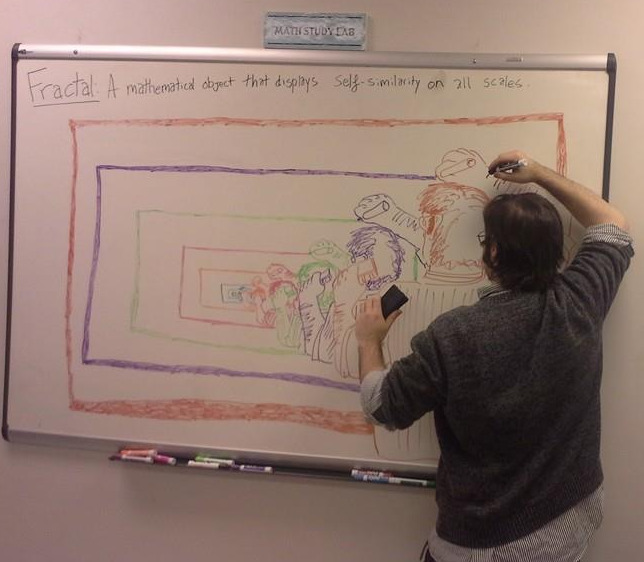
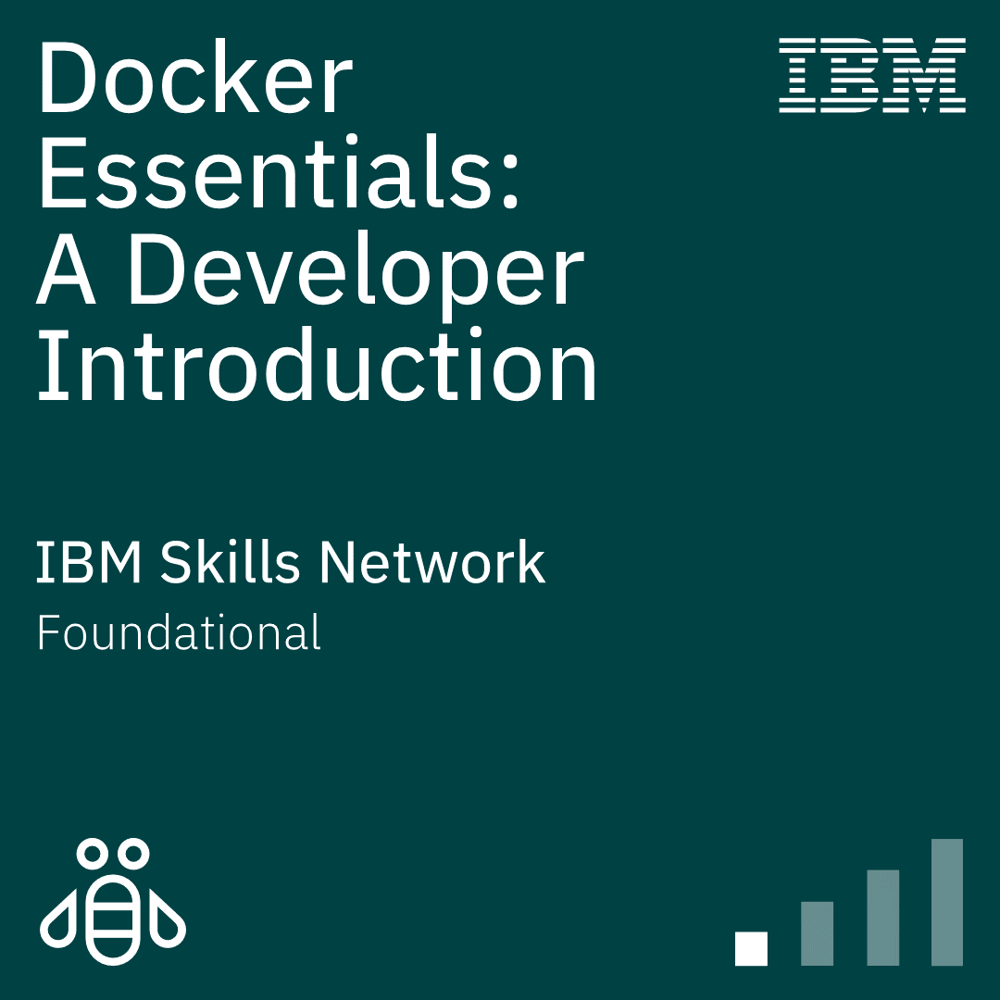
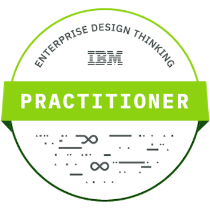
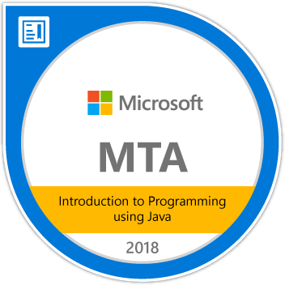
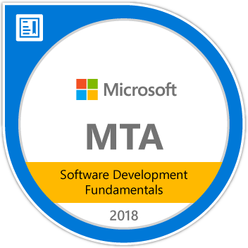
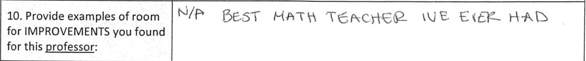
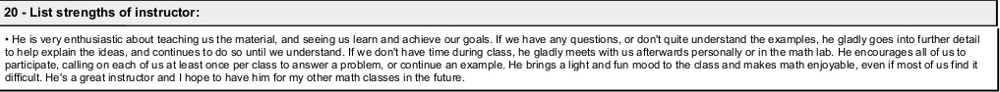

# Grant Moore

---

    

---

## Education

|  School  |  Degree  | Field of Study | Graduation |
|--------- | -------  | -------------- | ---------- |
| Towson University | Master's Degree | Mathematics | 2013 |
| Frostburg State University | Bachelor's Degree | Physics | 2010 |

## Experience

### Employment History 

| Employer  | Role  | Dates |
| --------  | ----  | ----- |
| ProvisionIAM | Senior DevOps Engineer | March 2025 - Present |
| MDThink    | DevOps Director       | June 2024 - December 2024 |
| Bishop Walsh | Math Teacher | September 2023 - June 2024 |
| IHS Markit | Software Engineer | October 2022 - March 2023 |
| Booz Allen Hamilton | Staff Engineer | June 2022 - December 2023 |
| Makpar | DevOps Engineer | October 2021 - May 2022 |
| IBM | Full Stack Developer | June 2019 - April 2021 |
| Front Range Community College | Mathematics Professor | January 2018 - December 2018 |
| University of Cincinnati | Adjunct Professor | August 2017 - December 2017 |
| YTI Career Institute | Math Instructor | August 2015 - December 2015 |
| Frostburg State University | Adjunct Professor | August 2015 - May 2017 | 
| Allegany College of Maryland | Adjunct Professor | January 2015 - December 2015 |
| Hamilton Relay | Relay Operator | April 2014 - December 2014 |
| IBM | Conversion Worker | November 2013 - April 2014 | 
| Walmart | Cashier | November 2011 - September 2012 |
| Active Network | Reservation Specialist | January 2011 - August 2011 |
| Savage River Lodge | Maintenance | June 2010 - November 2010 |
| Burger King | Slave | March 2009 - August 2009 | 
| Fox's Pizza | Delivery Driver |  February 2009 - January 2010 |
| Ruby Tuesday | Cook |  April 2008 - January 2009 |
| Denny's | Cook | June 2007 - February 2008 | 
| Banana Cafe | Dishwasher | May 2006 - September 2006 | 

### Volunteer History

| Organization | Role | Dates | 
| ------------ | ---- | ----- | 
| Americorps | Mathematics Tutor | August 2014 - August 2016 |

### Certifications

| Organization  | Certifications |
|-------------- | -------------- |
| AWS | 
  |
| IBM |   |
| MTA |  <a href="./assets/mta-introduction-to-programming-using-java-certified-2018.png>"></a>   |
| SOA | [Exam FM](./assets/soa-exam-fm.png) [Exam P](./assets/soa-exam-p.png) |

### Publications

- [Photographs of Autumn, Macrame Literary Journal, Summer 2025, Issue 1](https://macramelit.com/articles/photographs-of-autumn/)
- [Absurdity, The Genre Society, Issue 6](https://www.thegenresociety.com/readhere)
- [Father's Lullaby, Sublimation, Volume 2 Issue 5](https://islandofwakwak.com/sublimation-volume-2-2025.html)
- [The Unicode Ode & The Invocation of Metric Code, Infocalypse Press, Volume 1 Issue 1](https://www.infocalypse.press/issue-one/)
- [The Lives of Kites, Macrame Literary Journal, Issue 3](https://macramelit.com/articles/the-lives-of-kites/)
- [Holly Tree, The Celestial Glossary, Volume 1 Issue 1](https://estrellahp.com/celestial-glossary/issue-1/holly-trees/)
- [Larksong & Eulogy, Artists From Maryland, February 2026](https://www.artistsfrommaryland.org/february-2026-grant-moore/)
- [Pantoums of Dementia, Movement I: Undulation, Scribeworth Magazine, Volume 1 Issue 4](https://www.scribeworth.com/magazine)
- [Little Sprout & Millenia, WayWords Literary Journal, Issue 21: Theme of Wonder](https://www.amazon.com/dp/B0GPJ81RJM)
- [Eulogy & Pantoums of Dementia, Sligo Creek Publishing, Bearing Witness: Poems for Troubled Times](https://www.sligocreekpublishing.com/bearing-witness)
- [Floods, Four Tulips Magazine, 2026 Anthology](https://www.fourtulips.com/archives/floods)
- [Three Poems, Ultramarine Review](https://www.ultramarinereview.com/post/three-poems-by-grant-a-moore)
- [Absurdity & The Gap, Infopocalypse, Volume 1 Issue 2](https://www.infocalypse.press/issue-2-without-a-face/)
- [Five Poems, Garfield Lake Review](https://www.garfieldlakereview.com/recent)

### Testimonials

