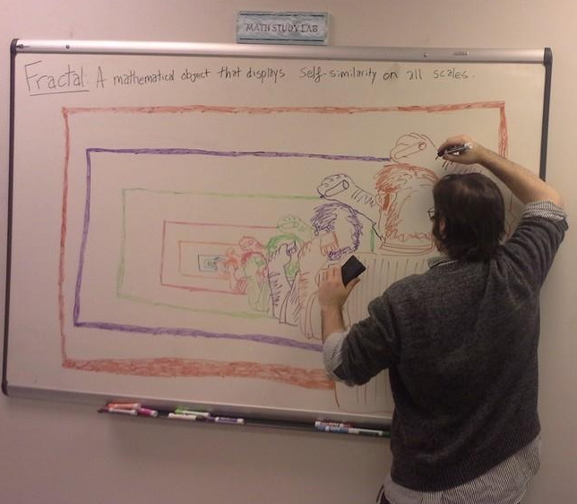

# Grant Moore

---

<div align="center">
    
</div>

---

```python
"""
The Invocation of Metric Code 
=============================

A Pythonic poem in (mostly) metric form. 

Hacks until the devs publish a fix:

- "()", "[]", ".", ":", "_",  "=" and "==" don't contribute!
- Comments are part of the poem! Except this first one!
- "pprint" = "puh-PRINT"

"""
from re import escape
import pprint
import invoke 
import my_heart
import provoke as smoke
import thy_art

def use(this="thought", with_mode="exhaust")
    """
    Where dreams become though some are lost...
    """
    try: # hope, but keep your fingers crossed...

        if not (with_mode in [ "act", "retain"]): 
            return "what's left of last remain"

        if type(set(this)) == thy_art.a_ring
            return my_heart.to_spring(
                myself_is = this, 
                but = [ "suffering" ]
            )

        # TODO: Alas! Another miss!
        raise smoke.abyss(with_only = this)

    except RecursionError as remiss:
        this = set(escape(remiss))
        pprint.pprint("renew, and don't dismiss!")
        return invoke.Oh.muse(" " and "please").sing(this)

# HOTFIX: Let this "==" be "is"! But only here!
# Oh, don't complain, just play the game! 
if __name__ == "__main__":
    invoke.with_fuse()
    invoke.Oh.muse([   
        one(use(this=dream, with_mode="retain"))
        for dream in smoke.of_wing
        if dream is all(thy_art.to_bring())
    ])
```

## Education

|  School  |  Degree  | Field of Study | Graduation |
|--------- | -------  | -------------- | ---------- |
| Towson University | Master's Degree | Mathematics | 2013 |
| Frostburg State University | Bachelor's Degree | Physics | 2010 |

## Experience

### Employment History 

| Employer  | Role  | Dates |
| --------  | ----  | ----- |
| ProvisionIAM | Senior Site Reliability Engineer | March 2025 - Present |
| MDThink    | DevOps Director       | June 2024 - December 2024 |
| Bishop Walsh | Math Teacher | September 2023 - June 2024 |
| IHS Markit | Software Engineer | October 2022 - March 2023 |
| Booz Allen Hamilton | Staff Engineer | June 2022 - December 2023 |
| Makpar | DevOps Engineer | October 2021 - May 2022 |
| IBM | Full Stack Developer | June 2019 - April 2021 |
| Front Range Community College | Mathematics Professor | January 2018 - December 2018 |
| University of Cincinnati | Adjunct Professor | August 2017 - December 2017 |
| YTI Career Institute | Math Instructor | August 2015 - December 2015 |
| Frostburg State University | Adjunct Professor | August 2015 - May 2017 | 
| Allegany College of Maryland | Adjunct Professor | January 2015 - December 2015 |
| Hamilton Relay | Relay Operator | April 2014 - December 2014 |
| IBM | Conversion Worker | November 2013 - April 2014 | 
| Walmart | Cashier | November 2011 - September 2012 |
| Active Network | Reservation Specialist | January 2011 - August 2011 |
| Savage River Lodge | Maintenance | June 2010 - November 2010 |
| Burger King | Slave | March 2009 - August 2009 | 
| Fox's Pizza | Delivery Driver |  February 2009 - January 2010 |
| Ruby Tuesday | Cook |  April 2008 - January 2009 |
| Denny's | Cook | June 2007 - February 2008 | 
| Banana Cafe | Dishwasher | May 2006 - September 2006 | 

### Volunteer History

| Organization | Role | Dates | 
| ------------ | ---- | ----- | 
| Americorps | Mathematics Tutor | August 2014 - August 2016 |

### Certifications

| Organization  | Certifications |
|-------------- | -------------- |
| AWS | <a href="./assets/aws-certified-developer-associate.png">  </a></div> <a href="./assets/aws-certified-devops-engineer-professional.png"> </a> |
| IBM | <a href="./assets/aws-certified-developer-associate.png"></a> <a href="./assets/ibm-docker-introduction.png">  </a> |
| MTA | <a href="./assets/mta-database-fundamentals-certified-2018.png"></a> <a href="./assets/mta-introduction-to-programming-using-java-certified-2018.png>"></a> <a href="./assets/mta-introduction-to-programming-using-python-certified-2018.png"></a> <a href="./assets/mta-software-development-fundamentals-certified-2018.png"></a> |
| SOA | [Exam FM](./assets/soa-exam-fm.png) [Exam P](./assets/soa-exam-p.png) |

### Testimonials


